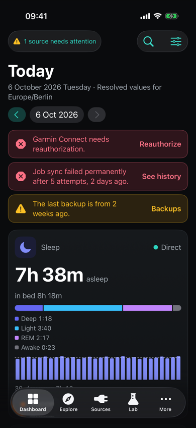
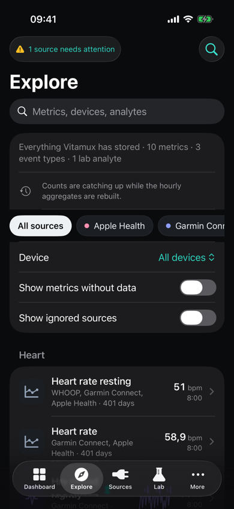
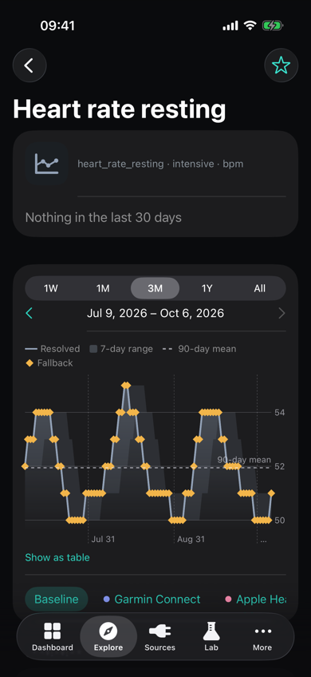
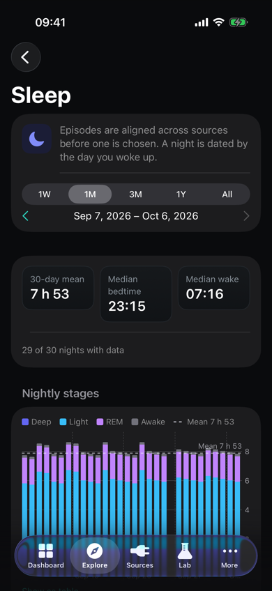
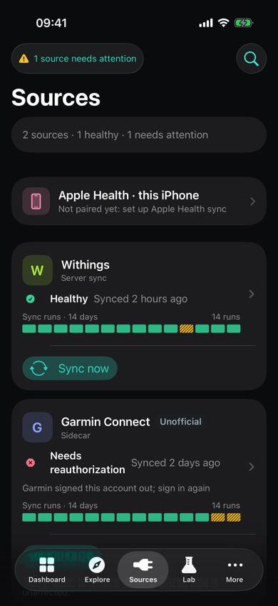
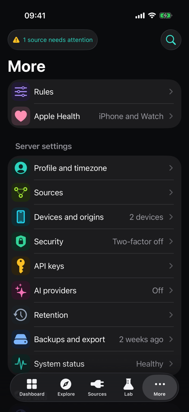
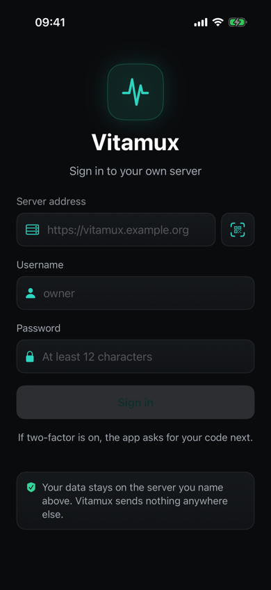
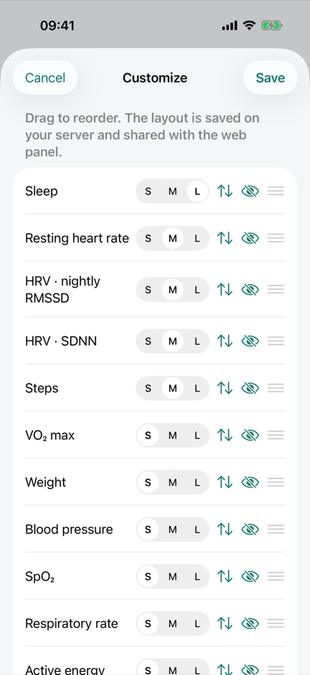

# Vitamux (iOS app)

The native iPhone client of a self-hosted Vitamux server ([E22](../../docs/plan/E22-ios-app/README.md), [design](../../docs/architecture/ios-app.md), [ADR-0023](../../docs/adr/0023-ios-app.md)). It replaced the Vitamux Bridge app (`apple/HealthBridgeApp`, removed in J22.14) and syncs Apple Health through [HealthBridgeKit](../HealthBridgeKit). J22.5 built the project, the server step and sign-in, the shell (tabs, search, sync status, theme, sign-out), the `vitamux://` router and app lock; screens later jobs build show a placeholder.

## Screens

<p>








</p>

Synthetic data from the fake server; the look is [ios-design](../../docs/architecture/ios-design.md). `scripts/screenshots.sh ["<simulator name>"]` refreshes them.

## Build from source

```sh
brew install xcodegen
cd apple/VitamuxApp
xcodegen generate
xcodebuild -project Vitamux.xcodeproj -scheme Vitamux -skipPackagePluginValidation \
  -destination 'platform=iOS Simulator,name=iPhone 17 Pro' build test
```

`project.yml` is the source of truth; `Vitamux.xcodeproj`, the `Info.plist`s and the entitlements are generated and not committed. Targets: the app `Vitamux`, the widget extension `VitamuxWidgets`, its tests `VitamuxWidgetsTests` and `VitamuxUITests`. Set `DEVELOPMENT_TEAM` for a device build. The bundle id and Keychain service stay Bridge's (`org.vitamux.healthbridge`), and the app's Keychain access group is its own identifier (shared with the widget), so an installed Bridge upgrades in place with its device token and anchors: `scripts/upgrade-from-bridge.sh` checks that on a simulator.

For a device build you need Xcode, an iPhone on iOS 18 or newer and an Apple Developer Program team. A paid membership is the supported path ([why](../../docs/architecture/apple-health.md#distribution)); a free account's profile expires after 7 days. Set `DEVELOPMENT_TEAM` in `project.yml` (and a bundle id you own if your team cannot register `org.vitamux.healthbridge`), regenerate and run. Automatic signing enables what `project.yml` declares: HealthKit with Background Delivery, Background fetch (the refresh task `org.vitamux.healthbridge.refresh`), the app group and Keychain group, and the purpose strings (`NSHealthShareUsageDescription`, read only; camera for QR scans; Face ID for app lock). Trust the developer certificate on first launch if iOS asks.

## Apple Health

More › Apple Health (`vitamux://apple-health`, `Features/AppleHealth`):

- **Pair.** Signed in, "Sync Apple Health from this iPhone" creates a pairing code and redeems it in one tap. For another server, create a code in its panel (Settings › Devices) and scan the QR (`{"url","code"}`) or type the https address and code. The device token gets its own Keychain item, apart from the sign-in, so syncing continues while signed out; unpairing revokes it on the signed-in server and forgets it here.
- **Groups.** Turning a group on asks iOS for read access and pulls its history in full. iOS never reveals a denial, so the app shows "Requested", and the server's "possibly denied" hint (a type silent for 7 days) appears per type.
- **Status.** Last sync, types waiting to re-send, the history pull's progress, per-type anchors, Sync now, "Pull again…" (local anchor reset) and resets requested on the server, which the app applies from `GET /api/ingest/v1/devices/self`. A revoked token stops syncing and offers "Pair again".
- **Sources.** Apple Health › Sources (`vitamux://apple-health/sources`) lists every app the iPhone found writing the enabled types, with what it writes and when, and lets you Take or Ignore each one, or choose its types. An app whose provider you connect to Vitamux directly (for example WHOOP) is ignored by default with the reason shown, so its copy in Apple Health is not counted twice. Ignored data never leaves the phone; taking an app again pulls its history. The panel offers the same under Settings › Devices › Sources ([how it works](../../docs/architecture/apple-health.md#source-filter)).
- **Privacy.** Read only; samples with their source app, device and timestamps go over HTTPS to your own server and nowhere else; no analytics or third parties. The same text is on the screen's privacy page.
- **Timing.** iOS decides when background delivery and the refresh task run; some types update at most hourly, delivery can pause in Low Power Mode or after a force-quit, and the Simulator never delivers in the background. Device results go in the [device checklist](../../docs/apple-health-device-checklist.md) (J22.23).

**Upgrading from Bridge:** install this app over Vitamux Bridge with the same bundle id; the pairing, enabled groups, anchors and HealthKit access carry over, with no re-pairing and no full re-pull. `scripts/upgrade-from-bridge.sh ["<simulator name>"]` checks it on a simulator against the last Bridge in git history.

## Widgets

Metric (small, medium, lock-screen rectangular, circular and inline), Sleep (with stages) and Metrics (three side by side), configured from the dashboard's cards (`Widgets/`, J22.20):

- **Data.** After each load of today the dashboard writes `WidgetSnapshot` (one small JSON file in the app group: the shown cards as formatted, and when they were fetched; answers from the offline cache keep their stored time). Sign-out, an ended session and a new sign-in remove it. The extension only reads it, the redaction preference and whether the session's Keychain item still exists; it has no client and never fetches, so the values are as fresh as the app's last dashboard load (Settings › This app shows when).
- **States.** "As of" time, with the weekday and a clock after 6 hours; "Open Vitamux to sign in" without values once the session is gone or idle for 30 days.
- **Privacy.** Values are `privacySensitive` and drawn as a blurred placeholder while locked, unless "Hide values while locked" is off.
- **Links.** A card opens `vitamux://explore/<metric>` (`/explore/sleep` and `/explore/blood-pressure` for the two families).
- **Tests.** `VitamuxWidgetsTests` (no host: a widget extension cannot host tests) covers the file, the session and stale rules, the timeline and links, and renders every family fresh, stale, signed out, locked and unlocked; set `TEST_RUNNER_WIDGET_RENDER_DIR` to keep the PNGs. `#Preview`s in `WidgetPreviews.swift`. The lock screen and refreshes over a day need a device (J22.23).

## UI tests

UI tests launch the app with `-uitest`: the kit's fake server (`FakeServer.uiTestServers`: `fake.vitamux.test`, plus `old.vitamux.test` from before the version handshake, `other.vitamux.test` that is not Vitamux, and any other `*.vitamux.test` unreachable), an in-memory session, cleared preferences and a fake HealthStore (no HealthKit prompts); app lock opens on the button. More arguments: `-uitest-totp` (two-factor on), `-uitest-paired` (a paired iPhone), `-uitest-revoked` and `-uitest-anchor-reset` (the server revoked that iPhone, or asks it to pull again), `-uitest-keep-device` (keep what a Bridge build left), `-uitest-empty-install` and `-uitest-panel-layout` (the dashboard's start: no data, or a layout saved in the panel). The link `vitamux://uitest/expire-sessions` ends the fake's sessions, for expiry mid-use. Open links in the running app with `openLink` (`UITestSupport.swift`); `XCUIApplication.open` relaunches it. More arguments: `-uitest-totp` (two-factor on), `-uitest-paired` (a paired iPhone), `-uitest-keep-device` (keep what a Bridge build left), `-uitest-empty-install` and `-uitest-panel-layout` (the dashboard's start: no data, or a layout saved in the panel), `-uitest-withings-env` (Withings app credentials set by the environment). `ScreenshotUITests` skips unless the runner has `SCREENSHOT_DIR` ([screens](#screens)).

## Layout

| Path | Contents |
| --- | --- |
| `Sources/App/` | `VitamuxApp` (entry), `AppState` (the one shared object: server, session, client, router, theme, app lock), `Route` (every linkable screen, `vitamux://` parsing), `RootView` (sign-in, lock or shell; app-switcher blur), `ShellView` (tabs and stacks), `RouteView` (the screen per route) |
| `Sources/Features/<Feature>/` | A feature's views and, where a screen loads or changes data, its `@Observable` model (`SignIn`, `Shell` for search and sync status, `Lock`, `More`, `Settings`, `AppleHealth`, …) |
| `Sources/Shared/` | Components used by more than one feature (`ProblemView`, `PlaceholderView`, `AppMark`), the design tokens (`Tokens.swift`, `Tokens.xcassets`) and the shared styles (`Card`: card surface, ground, section header, `ValueText`; `MetricTile`; `StatusChips`: status and source cues), per [ios-design](../../docs/architecture/ios-design.md) |
| `Sources/Assets.xcassets` | The app icon and the global accent colour |
| `Widgets/` | The widget extension (see [Widgets](#widgets)); `Shared/` is compiled into the app too, `Tests/` is `VitamuxWidgetsTests` |
| `UITests/` | UI tests, one file per screen |
| [`../VitamuxKit`](../VitamuxKit) | API client (J22.4), `Core` (`Loadable`, `Problem`), charts (J22.6) |

The app target is main-actor by default (`SWIFT_DEFAULT_ACTOR_ISOLATION`), so views and models need no `@MainActor`. No repositories, coordinators, view-model protocols or DI containers ([lean architecture](../../docs/architecture/ios-app.md#lean-architecture)).

## Worked example

System status (`vitamux://settings/system`) is the pattern every screen copies:

1. **Model** `Features/Settings/SystemStatusModel.swift`: an `@Observable` class holding one `Loadable<Value>` with `private(set)`, and an `async` `load()` that assigns `await Loadable { … }`. Later models call the generated client inside that closure.
2. **Screen** `Features/Settings/SystemStatusView.swift`: owns the model as `@State`, loads in `.task`, switches on the `Loadable`, shows failures with `ProblemView`, and splits sections into small private views.
3. **Route**: `Route.settings(.system)`: a case in `Route`, its path in `Route.init?(url:)` (the panel path, listed in [ios-app-screens](../../docs/architecture/ios-app-screens.md)), its tab in `Route.tab`, and its screen in `RouteView` (replacing the route's `PlaceholderView`).
4. **UI test** `UITests/SystemStatusUITests.swift`: sign in to the fake server, open the deep link, and check the screen by accessibility identifier.
