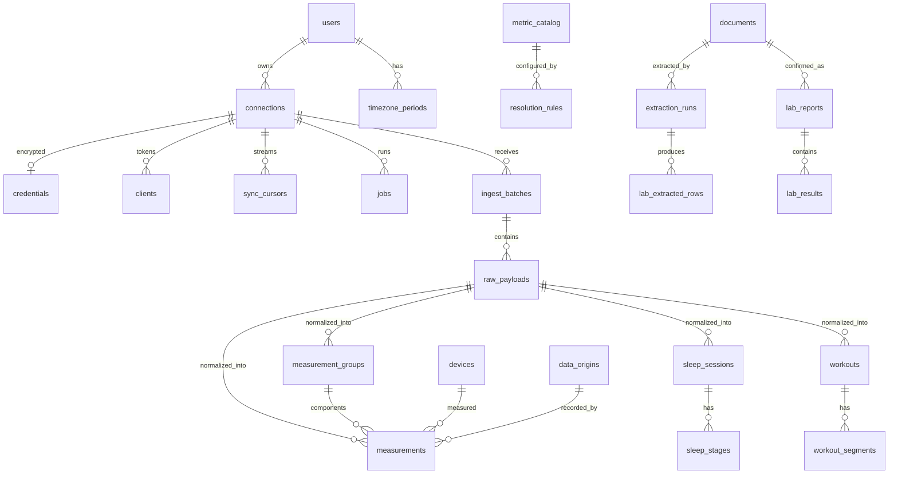

# Data model

## Principles

1. Resolution never overwrites source rows. It writes only rebuildable cache rows.
2. Corrections are versions. A changed upstream value inserts a new row and sets `superseded_at`/`superseded_by` on the old one. Upstream deletions set `deleted_at` + `deleted_by_raw_id`. Hard deletes happen only through owner deletion actions ([security.md](security.md#export-and-deletion)).
3. Use relational columns for anything filtered, joined, aggregated, or deduplicated. JSONB only for provider detail that is displayed or exported (`detail`, `context`, `request_meta`, `attributes`).
4. Events (sleep, workouts, grouped readings, lab results) have their own tables.
5. Every canonical row answers: user, provider, connection, device, origin, client/batch, metric, value, canonical and source unit, timestamps, local date, offset, kind, external id and dedupe key, fetched/normalized/superseded times, raw payload, normalizer version.

## ER diagram

## Identifiers and dedupe keys

- Entities use `uuid` (UUIDv7) keys, exposed with prefixes (`conn_`, `dev_`, …).
- High-volume tables (`raw_payloads`, `measurements`, `measurement_groups`, `sleep_stages`) use `bigint` identity keys.
- Catalogues use `smallint` keys.
- **Dedupe key** = first 16 bytes of SHA-256 over a versioned key string:
  - with a stable upstream id: `v1|provider|account_key|record_type|external_id|component`
  - otherwise: `v1|provider|account_key|metric|kind|start_utc_us|end_utc_us|device_fingerprint|origin_key`
- `account_key` = SHA-256 of the provider account id, stored on `connections`. Reconnecting the same account in a new connection row creates no duplicates, and importers produce the same keys as live sync.

## Tables

| Area | Tables (key columns / notes) |
| --- | --- |
| Identity | `users` (argon2id hash, encrypted TOTP secret) · `timezone_periods` (IANA tz, `valid_from`) · `settings` (key/value jsonb) · `sessions` · `api_keys` (id as token prefix, secret hash, scopes) · `audit_events` (append-only for the app role) |
| Sources | `providers` (seeded) · `connections` (`account_key`, `mode`, `status`, `config`, `last_success_at`; unique `(user, provider, account_key)`) · `credentials` (sealed ciphertext per [ADR-0011](../adr/0011-secrets-vault.md), `key_id`, `access_expires_at`, `version`) · `clients` (collector, iOS device, or importer tokens; `metadata` jsonb) · `devices` (`fingerprint`, `device_type`, manufacturer, model, versions; unique `(user, provider, fingerprint)`) · `data_origins` (`origin_key` e.g. HealthKit bundle id, `relayed_provider_id`, `is_native`) · `known_relay_origins` (seeded, editable patterns) |
| Sync | `schedules` (mode, interval, lookback, `next_run_at`) · `jobs` ([reliability.md](reliability.md#job-queue)) · `job_runs` · `sync_cursors` (cursor, watermark, stream status) · `backfills`, `backfill_units` · `provider_rate_state` (`blocked_until`) |
| Raw | `ingest_batches` (`source_kind`, `migration_source`, `idempotency_key`; unique `(client, key)`) · `raw_payloads` (stream, `external_key`, `version` + `supersedes_id`, `content_sha256` (also the blob key), `fetched_at`, sanitized `request_meta`, `shape_fingerprint`, status `stored/normalized/normalize_failed/quarantined`; unique `(connection, stream, external_key, version)`; same content as the latest version is a duplicate) · `blobs` (sha256, sizes, compression, encryption key ref, refcount; [ADR-0004](../adr/0004-blob-store.md)) |
| Canonical | `metric_catalog` · `units` · `normalizer_versions` · `measurements` (below) · `measurement_groups` (`kind` bp_reading/body_composition, `measured_at`, `context` jsonb) · `sleep_sessions` (`sleep_date` = local wake date, `is_nap`, stage totals, `totals_basis`, `has_stages`) · `sleep_stages` (awake/light/deep/rem/asleep_unspecified/in_bed) · `workouts` (canonical and provider sport, distance, energy, HR, `file_blob_sha256`) · `workout_segments` (lap/set/interval, `data` jsonb) |
| Resolution | `resolution_rules`, `active_rules`, `manual_overrides`, `resolution_dirty`, `resolved_cache`, `source_hourly_aggregates` ([resolution.md](resolution.md)) |
| Documents | `documents`, `document_keys`, `extraction_runs`, `lab_extracted_rows`, `extraction_row_edits`, `lab_reports`, `lab_results`, `lab_result_revisions`, `analytes`, `analyte_aliases` ([lab-documents.md](lab-documents.md)) |
| Imports | `import_runs`, `import_items` (unique `(source, item_key, checksum)`) — used by Apple export and migration importers |

All canonical event tables share the source and provenance columns: `connection_id`, `provider_id`, `device_id`, `origin_id`, `external_id`, `dedupe_key`, `raw_payload_id`, `normalizer_version_id`, `superseded_*`, `deleted_*`.

## Measurements

| Column | Notes |
| --- | --- |
| `id` bigint, `user_id`, `metric_id` smallint | |
| `kind` | `sample` (instant), `interval` `[start,end)`, `cumulative` (only if not convertible to intervals), `daily_value` (provider-reported value for a whole local day: total or summary) |
| `start_at`, `end_at` | `end_at` null for samples |
| `tz_offset_min`, `local_date` | Local date from the source offset, else from `timezone_periods` |
| `value` float8 | Canonical unit. `source_value`, `source_unit_id` only if conversion changed the value |
| `provider_id`, `connection_id`, `device_id`, `origin_id`, `group_id` | Source identity; group for BP and weigh-ins |
| `external_id`, `dedupe_key` | |
| `quality_flags` bitset | `manual_entry`, `motion_context`, `implausible`, `relayed`, `migrated_without_raw`, `prorated_source` |
| `raw_payload_id`, `normalizer_version_id`, `ingested_at`, `normalized_at` | Provenance (`fetched_at` lives on the raw row) |
| `superseded_at`, `superseded_by`, `deleted_at`, `deleted_by_raw_id` | History |

Indexes:

- `UNIQUE (dedupe_key) WHERE superseded_at IS NULL`
- `(user_id, metric_id, start_at)` partial on active rows
- `(user_id, metric_id, local_date) WHERE kind='daily_value'` (active)
- BRIN on `raw_payload_id` and on `ingested_at`

Upsert, in one transaction per raw payload:

1. No active row: insert.
2. Equal row: update only `normalizer_version_id`/`normalized_at` if the version changed.
3. Different row: insert the new row and supersede the old one.
4. Tombstone: set `deleted_at`.

Every change writes a `resolution_dirty(user, metric, local_date)` mark.

## Metric catalogue

The catalogue is owned by code (`internal/catalog`) and seeded into the DB. Metrics are combinable across sources **only if they share a code**. Implemented codes, units, kinds, aggregation and plausible ranges: [metrics.md](../metrics.md); rules and codes not yet implemented: [metric-catalog.md](metric-catalog.md). Lab analytes use their own catalogue: [analyte-catalog.md](analyte-catalog.md).

## Volume and partitioning

- A high-frequency HR source (6 s step) produces ~5.3 M rows/yr. Measured in J04.4: ~340 B per `measurements` row with indexes (heap 193, indexes 149), so ~1.8 GB for that source alone.
- Other intraday series add ~1–3 M rows/yr. Events stay under 100 k and take only a few MB.
- Raw blobs (zstd) are ~0.3–0.6 GB/yr (not measured).
- Total is about 1–3 GB/yr depending on sources: the full synthetic year (6.2 M rows from overlapping sources) takes 2.1 GB. Numbers, queries and method: [benchmarks/baseline.md](../benchmarks/baseline.md).
- No partitioning yet. Revisit at > 50 M measurement rows or if retention pruning becomes necessary. Options then: monthly range partitions, or dense per-source-hour array chunks.

## Retention

- Canonical rows, including superseded ones, are kept indefinitely. `retention.superseded_after_days` is optional.
- Raw payloads are kept by default. `retention.raw.<provider>.days` prunes only raw whose rows came from the current normalizer version, and the UI warns that pruned raw cannot be reprocessed.
- `job_runs` are kept 90 days; audit is kept forever; documents follow [lab-documents.md](lab-documents.md#privacy-controls).
