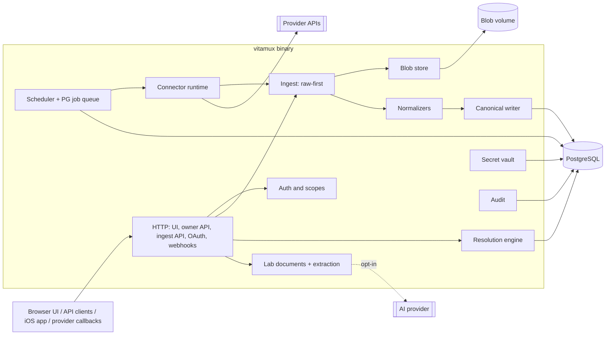

# Overview

Status: approved (G0, 2026-10-03). Product name **Vitamux**; binary and image prefix `vitamux`.

A self-hosted, single-owner, open-source health data aggregator. It does the following:

- collects from official APIs, on-device bridges, and file uploads;
- keeps the original responses;
- normalizes into a provider-independent model with provenance;
- resolves each metric and window through user-editable typed rules;
- serves a small configurator UI and a REST API;
- ingests blood-test PDFs with human-reviewed AI extraction.

## Goals

1. Install with Docker Compose on any machine: one app container plus PostgreSQL.
2. Raw-first: store the original provider response before transforming it, so normalization can be re-run.
3. Deterministic, versioned normalization, with provenance on every row.
4. Per-metric, per-window resolution (single source, fallback, or calculation) that never hides inputs.
5. Understandable by a small community: one repo, one backend binary, boring components.

## Non-goals (first releases)

- Multi-tenant SaaS, orgs, billing, roles. `user_id` exists only to avoid blocking multi-user later.
- Diagnosis, interpretation, coaching, clinical features.
- A general analytics suite or an expression language for rules.
- High availability, Kubernetes, brokers, workflow engines.

## Constraints

- PostgreSQL is the only database. No Redis or queue service.
- No credentials or real health data in git, fixtures, logs, or prompts.
- No required proprietary AI vendor. External extraction is opt-in per provider and per request.
- iOS background execution is system-controlled.

## Key decisions

ADRs are written during implementation (J01.1 and the owning jobs).

| # | Decision | Choice | Why |
| --- | --- | --- | --- |
| ADR-001 | Core language | **Go** | I/O-bound CRUD, HTTP, SQL, and jobs. Rust saves ~20–40 MiB, which is small next to PostgreSQL's 150–300 MiB, and costs slower development, harder cross-compiles, and fewer contributors. Go has pgx+sqlc, goose, stdlib routing, and static binaries. Other languages are allowed only in optional sidecars. |
| ADR-002 | Shape | Modular monolith, one binary with modes | Package boundaries enforced by lint; no service fleet |
| ADR-003 | Jobs | Own PostgreSQL queue (`SKIP LOCKED`, leases, dedupe keys, advisory-lock leader) | Small and transparent; River considered ([ADR-0003](../adr/0003-postgres-job-queue.md)) |
| ADR-004 | Raw storage | Filesystem content-addressed zstd blobs, metadata in PostgreSQL | Keeps the DB small; immutable blobs make backups simple |
| ADR-005 | Measurements | One `measurements` table with kinds; groups for BP and body composition; no partitioning yet | Personal scale (~10 M rows/yr worst case) |
| ADR-006 | Normalization | In Go, from raw payloads; adapters only fetch | Reprocessable, testable |
| ADR-007 | Execution modes | in-process, push, remote sidecar (v0.2.0) → one ingest pipeline | [connectors.md](connectors.md#execution-modes) |
| ADR-008/009 | Rules and sleep date | Typed rule schema v1; `sleep_date` = local wake date | [ADR-0008](../adr/0008-rule-schema.md), [ADR-0009](../adr/0009-sleep-date-night-window.md) |
| ADR-010 | Frontend | SvelteKit static SPA embedded via `go:embed` | No extra container; Node only at build time |
| ADR-020 | Charts | LayerChart behind our own chart kit, lazy-loaded | [ADR-0022](../adr/0022-layerchart.md) |
| ADR-021 | Source setup | Provider apps and panel sidecars sealed in PostgreSQL, the environment wins, a setup state per provider; no Docker socket | [ADR-0021](../adr/0021-source-setup.md) |
| ADR-011 | Secrets | Master key file, HKDF purposes, AES-256-GCM, single-flight token refresh | [security.md](security.md#keys-and-secrets) |
| ADR-012 | License | MIT + DCO (decided 2026-10-03) | Simplest permissive license; compatible with every planned dependency |
| ADR-013 | Extraction | Provider interface, consent model, no interpretation | [ADR-0013](../adr/0013-extraction-consent.md), [lab-documents.md](lab-documents.md) |
| ADR-014 | Apple Health | Swift package + minimal SwiftUI app; anchor committed after ack | [apple-health.md](apple-health.md) |
| ADR-015 | API | REST + OpenAPI 3.1 contract-first, problem+json, cursor pagination | [api.md](api.md) |
| ADR-016 | Dedupe | Account-scoped dedupe keys; corrections supersede | [ADR-0016](../adr/0016-canonical-writer.md) |
| ADR-017 | Sidecar protocol | `vitamux-connector/1`, frozen; additive only within v1 | [ADR-0017](../adr/0017-sidecar-protocol.md) |

Libraries: `pgx` v5, `sqlc`, `goose`, `log/slog`, `oapi-codegen`, `openapi-typescript`, `klauspost/compress` (zstd), `x/crypto` (argon2id; HKDF is stdlib `crypto/hkdf`), `pquerna/otp`, `pdf.js`.

## Components



## Deployment

The minimal reliable topology is **`vitamux` + `postgres`**, with volumes `pgdata`, `vitamux-data` (blobs, documents) and `vitamux-secrets` (`master.key`), and generated secret files for the database roles ([compose.md](../deploy/compose.md)). Optional sidecars, such as third-party collectors, are Compose profiles on the internal network. **Install targets:** plain Docker Compose (reference) and Coolify (a Compose variant that uses Coolify's proxy, domains and generated secrets), both in [install.md](../install.md). The deployer's reverse proxy (Caddy, Traefik, or Nginx) terminates TLS. The product ships an example but does not depend on it. No container publishes a host port except `vitamux` on `127.0.0.1:8080` by default (reverse proxy in front); containers run read-only with all capabilities dropped.

## Process modes

| Command | Purpose |
| --- | --- |
| `vitamux serve` | All-in-one: HTTP, scheduler leader, workers (no role split yet) |
| `vitamux migrate up\|status` | One-shot migrations (DDL owner role), run before `serve`; `down-to N` only in development |
| `vitamux healthcheck` | Container healthcheck: GET the local `/readyz` |
| `vitamux admin …` | `init-secrets [--if-missing]`, `create-owner`, `reset-password`, `purge-user` |
| `vitamux keys rotate` | Re-seal under the current master key ([key rotation](../operations/key-rotation.md)) |
| `vitamux reprocess` | Re-run normalizers over raw payloads |
| `vitamux import ndjson [--merge]` | Load a Vitamux export ([exports](api.md#exports)) |
| `vitamux import apple-health-export FILE` | Backfill from the Health app's export ([importer](apple-health.md#export-importer-fallback)) |
| `vitamux import batches [--dry-run] DIR` | Replay ingest batch files, e.g. a collector's archive, into their connections ([sidecars.md](../sidecars.md#replay-a-collectors-archive)) |
| `vitamux backup` / `vitamux restore` | Consistent backup bundle ([operations/backup.md](../operations/backup.md)) |
| `vitamux resolve verify` | Compare the resolved cache with live resolution |
| `vitamux version` | Version, commit, expected schema |

## Routes

| Prefix | Exposure | Auth |
| --- | --- | --- |
| `/`, `/api/v1/*` | Public via proxy | Owner session cookie or API key |
| `/api/ingest/v1/*` | Public via proxy (iOS app) | Client token scoped to one connection |
| `/oauth/{provider}/callback` | Public; `HEAD` → 204 | Signed single-use, session-bound `state` + browser-binding cookie ([flow](connectors.md#oauth-connection-flow)) |
| `/webhooks/{provider}/{hook_token}` | Public; `HEAD` → 204 | Unguessable token; payload is only a hint |
| `/healthz`, `/readyz` | Public allowed (no data) | None |
| `/metrics` on `VITAMUX_METRICS_ADDR` (off by default) | Private listener only | Network isolation |
| PostgreSQL, sidecars | Never public | DB roles; shared secret |

All absolute URLs come from `VITAMUX_PUBLIC_URL`. No host-specific values are compiled in.

## Repository layout

```text
cmd/vitamux/                  main + subcommands
internal/  api audit auth backup blob catalog config crypto db(sqlc, migrations) documents(extract, analytes)
           export httpx imports ingest jobs lifecycle metrics normalize obs provenance resolve version
           connectors/(runtime, ratelimit, withings, example)   testutil/fakeprovider
web/                          SvelteKit SPA (embedded at build)
api/openapi.yaml, authz.yaml  schemas/ (ingest, rule, lab extraction JSON Schemas)
prompts/lab-extraction/       fixtures/ (synthetic)   tools/ (fixturegen, fixtureguard, labeval, notices, apiref, doclinks, ...)
deploy/compose/, coolify/, sql/   docs/ (this tree, adr/)
LICENSE NOTICE THIRD_PARTY_NOTICES.md SECURITY.md
```

The Swift package and app (`apple/`) and `internal/connectors/applehealth` arrive with [E15](../plan/E15-apple-health/README.md). [E22](../plan/E22-ios-app/README.md) adds `apple/VitamuxKit` and replaces `apple/HealthBridgeApp` with `apple/VitamuxApp` ([ios-app.md](ios-app.md)).

## Glossary

| Term | Meaning |
| --- | --- |
| Provider | Data vendor or transport: `withings`, `apple_health`, `manual`, `lab_document`, … |
| Connection | One authorized provider account; owns credentials, schedules, cursors, health |
| Stream | Independently cursored feed of a connection (e.g., `withings.measures`) |
| Work unit | Bounded fetch (stream + range or page); backfills are lists of units |
| Raw payload | One unmodified provider response or file, stored before normalization |
| Origin | App that recorded a relayed record (e.g., a HealthKit source bundle) |
| Source group | Named, ordered selector set in a resolution rule |
| Window | Time span a resolved result describes |
