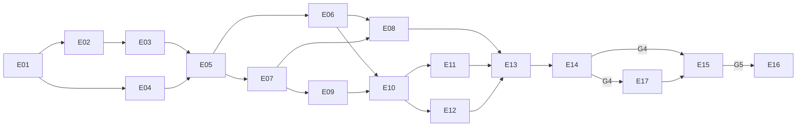

# Implementation plan

Structure: `plan/<Epic>/README.md` (objective, acceptance, job table), then `plan/<Epic>/<Job>.md` (objective, outputs, done-when, task checklist).

**Working a job:**

1. Read the job file and only the architecture sections it links.
2. Set `Status:` to `in progress`.
3. Tick tasks as they finish.
4. Set `Status: done` once every "Done when" item holds.

Keep docs lean: update the smallest relevant file and link rather than repeat.

Conventions:

- IDs `E01`, `J01.1`, `T01.1.1`.
- No calendar estimates.
- "Synthetic" means generated data with no real identifiers.
- **post-MVP** jobs are optional for v0.1.0.

## Epics

| Epic | Title | Release | Depends on |
| --- | --- | --- | --- |
| [E01](E01-bootstrap/README.md) | Repository bootstrap and contributor experience | MVP | G0 |
| [E02](E02-database/README.md) | Database foundation and migrations | MVP | E01 |
| [E03](E03-security-foundation/README.md) | Security foundation: secrets, auth, tokens | MVP | E02 |
| [E04](E04-fixtures-harness/README.md) | Synthetic fixtures and test harness | MVP | E01 (J04.4: E02) |
| [E05](E05-ingestion/README.md) | Ingestion contract and raw archive | MVP | E02, E03, E04 |
| [E06](E06-jobs-sync/README.md) | Jobs, scheduling and sync state | MVP | E02, E03, E05 |
| [E07](E07-normalization/README.md) | Normalization framework and provenance | MVP | E02, E05 |
| [E08](E08-withings/README.md) | Withings official connector | MVP | E03, E06, E07 |
| [E09](E09-resolution/README.md) | Resolution engine | MVP | E04, E07, G2 |
| [E10](E10-query-api/README.md) | Query and configuration API | MVP | E03, E06, E07, E09 |
| [E11](E11-frontend/README.md) | Configurator frontend | MVP | E10, G2 |
| [E12](E12-lab-documents/README.md) | Blood-test documents | MVP | E03, E05, E06, E10 |
| [E13](E13-hardening/README.md) | Security and privacy hardening | MVP | E05–E12 |
| [E14](E14-release-v0.1/README.md) | OSS docs, licensing, **v0.1.0** | MVP | E01–E13 |
| | **— MVP boundary (v0.1.0) —** | | |
| [E15](E15-apple-health/README.md) | Apple Health Bridge (required) | v0.2.0 | E05, E07, E09, E11, G3; completes after G4 |
| [E17](E17-sidecar-connectors/README.md) | Remote sidecar connectors and third-party collectors | v0.2.0 | E06, E07, E11, G4 |
| [E16](E16-migration/README.md) | Reference installation and migration (**final, deferred**) | deploy | G5 |

## Gates

| Gate | Meaning | Produced by | Blocks |
| --- | --- | --- | --- |
| G0 | Owner approves `docs/architecture/` and this plan | Review | E01 |
| G1 | Foundational ADRs accepted, project name chosen | J01.1 | E02 onward |
| G2 | Rule schema v1 and sleep-date convention accepted | J09.1 | J09.2+, E11 rule UI |
| G3 | Ingest batch schema v1 frozen | J05.1 | E15 contract work |
| G4 | v0.1.0 released | J14.5 | E15 completion |
| G5 | v0.2.0 released (E15 and E17) | J15.9 | E16 |

## Parallel streams

1. After G1: E02 and E04 (J04.1–J04.3).
2. After J05.3: E06 and E07.
3. After E06 and E07: E08 and E09 (E09 uses synthetic canonical data).
4. E12 runs alongside E08–E11 once E03, E05 and E06 exist. Its UI job waits for J11.1.
5. E15 jobs J15.1, J15.3 and J15.4 can start after G3.
6. J13.1 (threat model) can start early. The rest of E13 runs once features exist.
7. J17.1 can start once E06 and E07 are done. E17 runs alongside E15.
