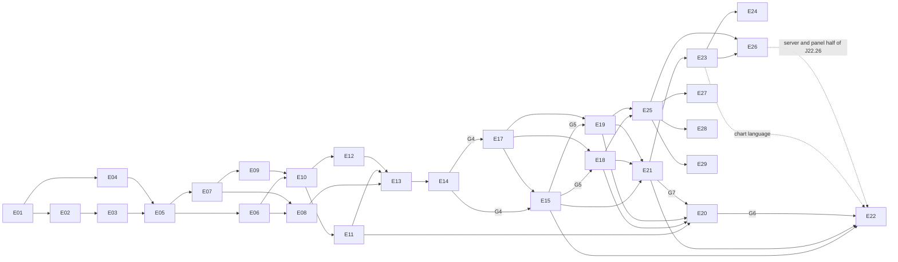

# Implementation plan

Structure: `plan/<Epic>/README.md` (objective, acceptance, job table), then `plan/<Epic>/<Job>.md` (objective, outputs, done-when, task checklist).

**Working a job:**

1. Read the job file and only the architecture sections it links.
2. Set `Status:` to `in progress`.
3. Tick tasks as they finish.
4. Set `Status: done` once every "Done when" item holds.

Keep docs lean: update the smallest relevant file and link rather than repeat.

Conventions:

- IDs `E01`, `J01.1`, `T01.1.1`.
- No calendar estimates.
- "Synthetic" means generated data with no real identifiers.
- **post-MVP** jobs are optional for v0.1.0.

## Epics

| Epic | Title | Release | Depends on |
| --- | --- | --- | --- |
| [E01](E01-bootstrap/README.md) | Repository bootstrap and contributor experience | MVP | G0 |
| [E02](E02-database/README.md) | Database foundation and migrations | MVP | E01 |
| [E03](E03-security-foundation/README.md) | Security foundation: secrets, auth, tokens | MVP | E02 |
| [E04](E04-fixtures-harness/README.md) | Synthetic fixtures and test harness | MVP | E01 (J04.4: E02) |
| [E05](E05-ingestion/README.md) | Ingestion contract and raw archive | MVP | E02, E03, E04 |
| [E06](E06-jobs-sync/README.md) | Jobs, scheduling and sync state | MVP | E02, E03, E05 |
| [E07](E07-normalization/README.md) | Normalization framework and provenance | MVP | E02, E05 |
| [E08](E08-withings/README.md) | Withings official connector | MVP | E03, E06, E07 |
| [E09](E09-resolution/README.md) | Resolution engine | MVP | E04, E07, G2 |
| [E10](E10-query-api/README.md) | Query and configuration API | MVP | E03, E06, E07, E09 |
| [E11](E11-frontend/README.md) | Configurator frontend | MVP | E10, G2 |
| [E12](E12-lab-documents/README.md) | Blood-test documents | MVP | E03, E05, E06, E10 |
| [E13](E13-hardening/README.md) | Security and privacy hardening | MVP | E05–E12 |
| [E14](E14-release-v0.1/README.md) | OSS docs, licensing, **v0.1.0** | MVP | E01–E13 |
| | **— MVP boundary (v0.1.0) —** | | |
| [E15](E15-apple-health/README.md) | Apple Health Bridge (required) | v0.2.0 | E05, E07, E09, E11, G3; completes after G4 |
| [E17](E17-sidecar-connectors/README.md) | Remote sidecar connectors and third-party collectors | v0.2.0 | E06, E07, E11, G4 |
| [E18](E18-garmin/README.md) | Garmin Connect connector (unofficial sidecar) | v0.3.0 | E17, G5 |
| [E19](E19-whoop/README.md) | WHOOP connector (unofficial sidecar) | v0.3.0 | E17, G5 |
| [E20](E20-guided-setup/README.md) | Guided source setup in the web panel | v0.2.1 | E11, E17; E18, E19 for J20.4–J20.5 |
| [E21](E21-visualisation/README.md) | Panel redesign, dashboard and data exploration | v0.2.0 | E11, E12, E15, E17–E19 (shipped in v0.1.1) |
| [E22](E22-ios-app/README.md) | Vitamux iOS app (replaces Vitamux Bridge; full Apple Watch data) | v0.4.0 | E15, E21, G6 (J22.1 and J22.15 can start now) |
| [E23](E23-chart-redesign/README.md) | Charts and metric visualisation redesign (LayerChart) | v0.3.0 | E21 |
| [E24](E24-resolution-visibility/README.md) | Resolution defaults, opt-in gates and visible data | v0.3.1 | E09, E21, E23 |
| [E25](E25-catalogue-mappings/README.md) | Catalogue completeness and mapping corrections | v0.3.1 | E07, E08, E15, E18, E19 |
| [E26](E26-intraday-views/README.md) | Intraday views on the server and the panel | v0.3.2 | E23, E25 |
| [E27](E27-oura/README.md) | Oura official connector | v0.3.3 | E20, E25 |
| [E28](E28-polar/README.md) | Polar official connector | v0.3.4 | E20, E25 |
| [E29](E29-google-health/README.md) | Fitbit and Pixel through the Google Health API (blocked) | when unblocked | E20, E25 |

## Gates

| Gate | Meaning | Produced by | Blocks |
| --- | --- | --- | --- |
| G0 | Owner approves `docs/architecture/` and this plan | Review | E01 |
| G1 | Foundational ADRs accepted, project name chosen | J01.1 | E02 onward |
| G2 | Rule schema v1 and sleep-date convention accepted | J09.1 | J09.2+, E11 rule UI |
| G3 | Ingest batch schema v1 frozen | J05.1 | E15 contract work |
| G4 | v0.1.0 released | J14.5 | E15 completion |
| G5 | v0.2.0 released (E15 and E17) | J15.9 | E18 and E19 releases |
| G6 | E18, E19 and E20 released (v0.1.1, v0.2.1) | J19.7 | — |
| G7 | v0.2.0 released (E21) | J21.13 | E20 UI jobs (build on the E21 kit) |
| G8 | v0.4.0 released (E22, the iOS app) | J22.23 | — |
| G9 | v0.3.0 released (E23) | J23.9 | — |

## Parallel streams

1. After G1: E02 and E04 (J04.1–J04.3).
2. After J05.3: E06 and E07.
3. After E06 and E07: E08 and E09 (E09 uses synthetic canonical data).
4. E12 runs alongside E08–E11 once E03, E05 and E06 exist. Its UI job waits for J11.1.
5. E15 jobs J15.1, J15.3 and J15.4 can start after G3.
6. J13.1 (threat model) can start early. The rest of E13 runs once features exist.
7. J17.1 can start once E06 and E07 are done. E17 runs alongside E15.
8. J18.1 and J19.1 (upstream and API verification) can start at any time. The rest of E18 and E19 follows J17.3; they run in parallel with each other and with E15.
9. J20.1–J20.3 (setup ADR, app-credential store, Withings wizard) can start now. J20.4 follows J17.2, and J20.5 follows J18.2 and J19.2.
10. J21.1, J21.2, J21.5 and J21.6 (design spec, chart ADR, inventory and summary APIs) can start now. J21.3 (design system and shell) can land before E20's UI jobs so they build on it.
11. J22.1 (app ADR) and J22.15 (Watch data contract) can start now; app sessions, the native auth return and VitamuxKit (J22.2–J22.4) follow J22.1. Once J22.5 lands, the screen jobs J22.7–J22.13 and Apple Health (J22.14) run in parallel; the setup wizards in J22.11 follow E20. The Watch kit and server jobs (J22.16, J22.17) run alongside them.
12. J23.1, J23.2 (LayerChart ADR) and J23.5 (API fields) can start now. Once J23.4 lands, J23.6–J23.8 run in parallel.
13. E24 (J24.1–J24.3, J24.6) and J25.1 can start now; J25.2–J25.5 and J25.7 run in parallel after J25.1. E26 follows E25. J27.1 and J28.1 (API verification) can start any time; E29 waits on Google's onboarding (J29.1).
